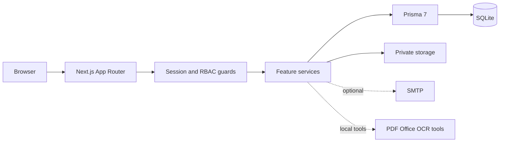

# Architecture

## Overview

CohortHarbor Onboarding Platform is a self-hosted Next.js application. The browser talks to the App Router pages and API routes; server-side feature services apply authentication, role checks, content visibility rules and file authorization before touching the database or private storage.

## Repository structure

- `src/app/`: App Router pages, layouts and API routes.
- `src/features/`: domain services and UI components for authentication, employees, roster import, policies, guides, onboarding materials, exams, reminders, notifications, portal editing and onboarding mail.
- `src/lib/`: shared environment parsing, database client, sessions, storage guards, UI primitives and watermark rendering.
- `prisma/`: schema, migrations and public seed descriptors.
- `scripts/`: database setup, seed, admin initialization, imports and worker commands.
- `tests/`: unit and integration tests; `e2e/`: Playwright browser tests.
- `storage/private/`: runtime-only database and file assets. It is intentionally ignored by Git.

## Frontend and backend boundaries

The frontend is rendered by Next.js and uses feature components to call same-origin API routes. The backend boundary is the API route or server action: it obtains the active session, checks the requested view mode and role, validates inputs, calls a feature service, and returns a response. Client-side visibility controls improve UX but do not replace server authorization.

## Main data flow

1. A user signs in through the auth routes. The server creates and validates an expiring session.
2. The route resolves the current user and view mode, then applies `EMPLOYEE`, `ADMIN` or `SUPER_ADMIN` authorization.
3. Feature services read or write Prisma records. Published status, city, employee module settings and ownership are checked as part of the query or service operation.
4. File operations resolve a database asset to a path below the configured private root. The file is validated before storage and streamed with private, no-store response headers.
5. Optional mail and local document tools are invoked only when explicitly configured. Their credentials and source files stay outside the repository.

## Permission model

| Role | Typical scope |
| --- | --- |
| `SUPER_ADMIN` | All admin functions, administrator lifecycle and super-admin-only security operations. |
| `ADMIN` | Employee, content, exam, reminder and mail operations allowed by the existing admin guards. |
| `EMPLOYEE` | Published employee-facing guides, policies, onboarding materials, exams, results, retakes and notifications for the current account. |

The existing role names and employee binding rules are part of the application contract. Open-source preparation does not rename or weaken them. A management account can switch its view mode, but it does not impersonate another employee.

## AI boundary

The current release does not contain an LLM client, embedding pipeline or autonomous Agent loop. It does provide structured policy/document content, access control, preview/OCR import paths and workflow events that can support a future permission-aware assistant. The proposed extension is documented in [ai-agent.md](ai-agent.md) and must preserve the same tenant, role and audit boundaries.
